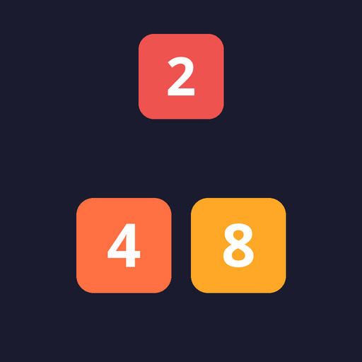
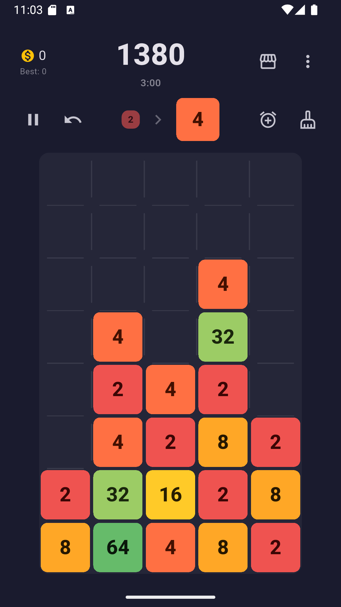
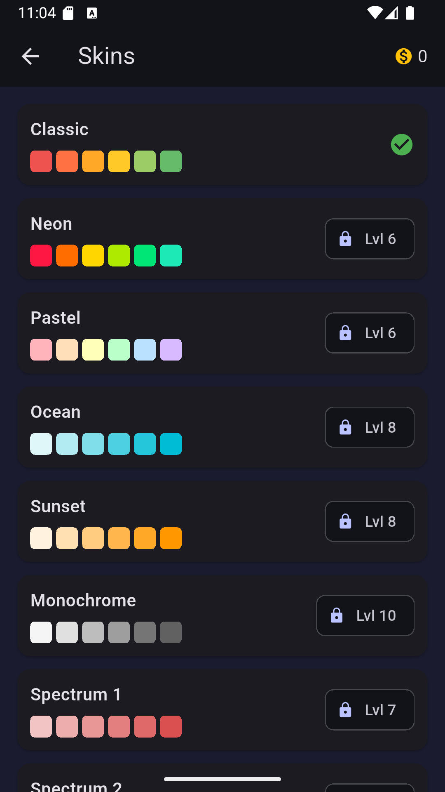
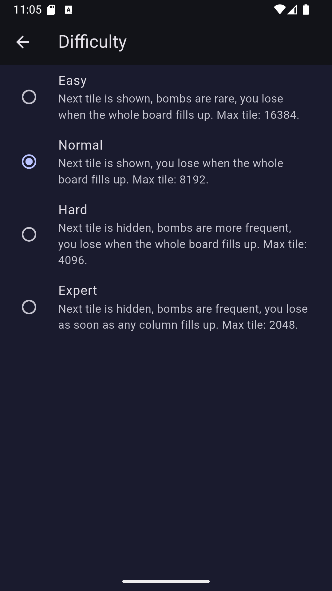
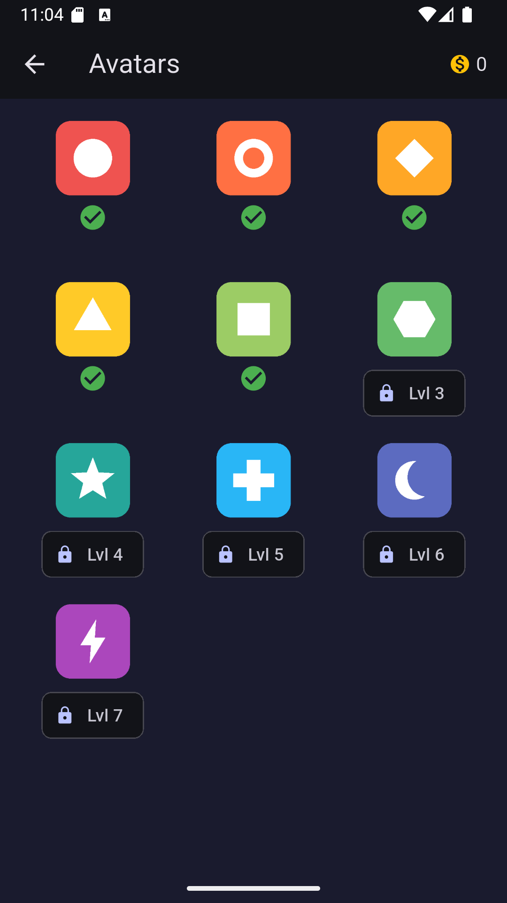
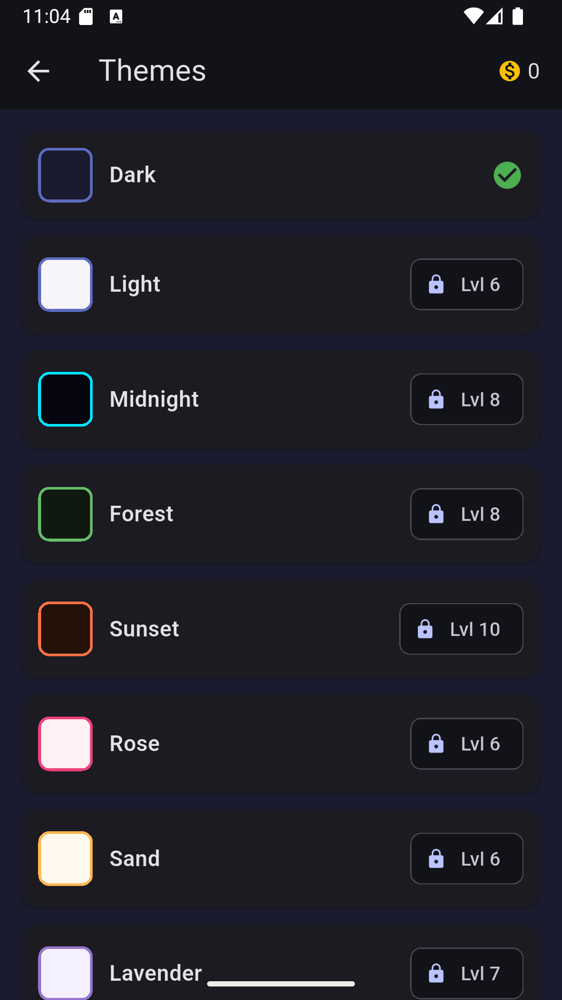
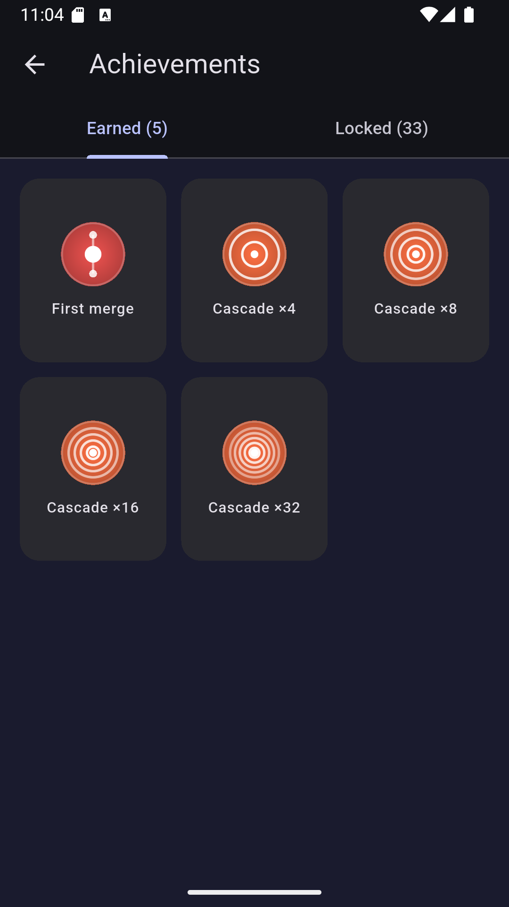

#  Dropoly

### Тапай, роняй, сливай — головоломка, в которой каждая плитка запускает цепную реакцию

  
  
  

---

## О чём игра

Dropoly — казуальная головоломка в жанре *number merge drop* (в духе Drop the Number, 2248, Merge Block). Никакой ходов на клетку и никакой перегрузки правилами: тапаешь по колонке — плитка падает вниз и сливается с соседями того же номинала. Слияние может задеть следующую плитку, та — ещё одну, и по полю пробегает каскад слияний, который сам считает себе множитель очков. Простое правило, но взгляд не оторвать — и одной партией дело обычно не ограничивается.

## Как играть

- **Тап по колонке** — плитка падает и сливается с соседями того же номинала (степени двойки: 2, 4, 8, 16…)
- **Каскады** — одно слияние запускает следующее, очки начисляются за номинал × множитель каскада: чем длиннее цепочка, тем жирнее счёт
- **Бесконечный забег** — без уровней и подсказок «пройди дальше»: цель — личный рекорд по очкам и максимальному номиналу на поле

## Прокачка и награды

За игру начисляются монеты и опыт — уровень игрока открывает новые скины, аватары и темы оформления. Это не косметика ради косметики: прогресс в забегах напрямую превращается в то, чем можно играть дальше.

  
  
  

- **Скины плиток** — от классической палитры до неона, пастели, океана и монохрома
- **Аватары** — 12 значков профиля, часть открывается сразу, остальные — по уровню
- **Темы интерфейса** — Dark, Light, Midnight, Forest, Sunset и другие
- **Достижения** — за первое слияние, за каскады x4, x8, x16, x32 и дальше — есть что коллекционировать

## Сложность под настроение

Одно и то же поле играется совсем по-разному в зависимости от режима:

| Режим | Что меняется | Максимальная плитка |
|---|---|---|
| Easy | Следующая плитка видна, бомбы редки, проигрыш — только когда занято всё поле | 16384 |
| Normal | Следующая плитка видна, проигрыш — когда занято всё поле | 8192 |
| Hard | Следующая плитка скрыта, бомбы чаще, проигрыш — когда занято всё поле | 4096 |
| Expert | Следующая плитка скрыта, бомб много, проигрыш — как только заполнилась хотя бы одна колонка | 2048 |

## Ежедневный челлендж

Каждый день — один и тот же сид для всех: одинаковая последовательность плиток выпадает у каждого игрока. Условия честные, разница только в том, кто лучше распорядится одинаковым набором.

## Без аккаунтов и без интернета

Играть можно полностью офлайн — прогресс, монеты и рекорды хранятся прямо на устройстве. Не нужно ни регистрироваться, ни быть онлайн, чтобы уронить очередную плитку.
